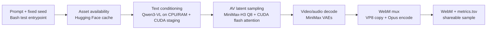

# video-streaming-minimax-h3

Single-source configuration and service tooling for video streaming based on
[MiniMax-H3](https://huggingface.co/MiniMaxAI/MiniMax-H3), served via
[llama.cpp](https://github.com/ggml-org/llama.cpp) with an OpenAI-compatible
API. Same philosophy as
[`4x_RTX3090_qwen3.8-27b`](https://github.com/michellacle/4x_RTX3090_qwen3.8-27b):
one repo, one model, config-first, no unnecessary abstraction.

This repo is organized around **deployment targets** — each target is a
self-contained, single source of configuration for one piece of hardware.
Only one target is implemented today.

| Target | Hardware | Status |
|--------|----------|--------|
| [`dev-rtx4070`](targets/dev-rtx4070/) | 1x NVIDIA RTX 4070 (8 GB VRAM) | **Implemented** — dev/test |
| [`prod-multi-gpu`](targets/prod-multi-gpu/) | Multi-GPU production machine | Full-BF16 capacity preflight available |

## `dev-rtx4070` target (implemented)

- **Model:** MiniMax-H3
- **Artifact:** [`unsloth/MiniMax-H3-GGUF`](https://huggingface.co/unsloth/MiniMax-H3-GGUF),
  file `minimax_h3_fl2va_pruned-Q2_K.gguf`
- **Why this quant:** Q2_K is the lowest-bit-width (smallest) quantization
  unsloth publishes for MiniMax-H3. It's the only realistic way to fit the
  model, its GPU-resident layers, and KV cache into an 8 GB RTX 4070 — this
  is a dev/test target, not a quality benchmark.
- **Hardware:** 1x NVIDIA RTX 4070 (8 GB VRAM)
- **Engine:** llama.cpp `llama-server` (CUDA build), OpenAI-compatible API
- **OS:** Linux (tested on Ubuntu; should work on any Linux with NVIDIA
  drivers + CUDA)

All settings for this target live in one file:
[`targets/dev-rtx4070/dev-rtx4070.env.example`](targets/dev-rtx4070/dev-rtx4070.env.example).
Copy it to `targets/dev-rtx4070/dev-rtx4070.env` and edit as needed — every
script in this repo reads its configuration from there.

| Variable            | Default                                 | Description                              |
|---------------------|------------------------------------------|-------------------------------------------|
| `MMH3_HF_REPO`      | `unsloth/MiniMax-H3-GGUF`                | Hugging Face repo hosting the GGUF quants |
| `MMH3_GGUF_FILE`    | `minimax_h3_fl2va_pruned-Q2_K.gguf`      | Specific GGUF artifact to use             |
| `MMH3_MODEL_PATH`   | `~/models/minimax-h3-gguf/<gguf file>`   | Local path to the downloaded GGUF file    |
| `MMH3_PORT`         | `8188`                                    | HTTP port                                 |
| `MMH3_HOST`         | `0.0.0.0`                                 | Bind address                              |
| `MMH3_GPU_LAYERS`   | `-1`                                      | Layers offloaded to GPU (`-1` = as many as fit) |
| `MMH3_CTX_SIZE`     | `8192`                                    | Context window (tokens)                   |
| `MMH3_PARALLEL`     | `1`                                       | Concurrent request slots                  |
| `MMH3_BATCH_SIZE`   | `512`                                     | Prompt batch size                         |
| `MMH3_UBATCH_SIZE`  | `128`                                     | Micro-batch size                          |

Override inline: `MMH3_PORT=9000 bash serve.sh`

### Requirements

| Component | Version | Notes |
|-----------|---------|-------|
| NVIDIA driver | >= 535 | Provides CUDA runtime libraries |
| CUDA toolkit + `cmake`/build tools | any recent | Needed to build llama.cpp with CUDA (`install.sh` invokes `cmake`) |
| Python | 3.9+ | Only used for `download_model.py` (via a small venv) |
| Disk | ~2-3 GB | Q2_K GGUF file + llama.cpp build |
| VRAM | 8 GB (RTX 4070) | Sized for this GPU; not all layers may fit on GPU at this quant/context — remaining layers fall back to CPU RAM automatically |

### Install as systemd service

```bash
sudo bash install.sh
```

This repo supports both install scopes:

- `bash install.sh` — install as the current user's `systemd --user` service
- `sudo bash install.sh` — install system-wide

For a non-root install, the service follows the user's systemd session by
default. If you want it to survive logout or start on reboot without an active
login session:

```bash
sudo loginctl enable-linger "$USER"
```

Options:

```bash
bash install.sh --user-install
sudo bash install.sh --port 9000
sudo bash install.sh --model /path/to/minimax_h3_fl2va_pruned-Q2_K.gguf
sudo bash install.sh --skip-download   # model already on disk
sudo bash install.sh --dry-run         # preview without installing
```

Hugging Face token (only needed if the repo/file requires one):

```bash
export HF_TOKEN=hf_...
sudo -E bash install.sh
```

Manage the service:

```bash
systemctl status video-streaming-minimax-h3-dev-rtx4070      # check status
journalctl -u video-streaming-minimax-h3-dev-rtx4070 -f      # follow logs
sudo bash restart.sh                                          # restart
sudo bash uninstall.sh                                         # remove service
```

For a non-root install:

```bash
systemctl --user status video-streaming-minimax-h3-dev-rtx4070
journalctl --user -u video-streaming-minimax-h3-dev-rtx4070 -f
bash restart.sh --user-install
bash uninstall.sh --user-install
```

### Manual run

```bash
# Download just the Q2_K GGUF file
python3 download_model.py unsloth/MiniMax-H3-GGUF \
  minimax_h3_fl2va_pruned-Q2_K.gguf \
  --local-dir ~/models/minimax-h3-gguf

# Start (requires a llama.cpp `llama-server` build with CUDA; see install.sh)
bash serve.sh

# Stop
bash kill-server.sh

# Validate the running service
bash test.sh

# Check GPU health/usage
bash gpu-status.sh

# Clean logs
bash clean-logs.sh

# Pre-flight check only (don't start)
MMH3_CHECK_ONLY=1 bash serve.sh
```

### Render a simple 30-second MiniMax-H3 test clip

The OpenAI-style `llama.cpp` server path above is not suitable for MiniMax-H3
video generation. For a quick local render smoke test on the RTX 4070 target, use
[`render-test.sh`](/home/michel/code/video-streaming-minimax-h3/render-test.sh),
which follows the published `stable-diffusion.cpp` MiniMax-H3 workflow and
stitches two short segments into one 30-second WebM clip.

```bash
bash render-test.sh
```

What it does:

- builds `stable-diffusion.cpp` with CUDA + WebM support
- downloads the supported MiniMax-H3 diffusion model, text encoder, video VAE,
  and audio VAE
- renders two 15-second segments at 320x192 / 24 fps / 4 steps
- concatenates them into one valid 30-second WebM clip with `ffmpeg`, retaining
  the VP8 video stream and encoding audio as Opus

Outputs land under `~/videos/minimax-h3/<timestamp>/`.

### Check official full-BF16 capacity

The official [MiniMaxAI/MiniMax-H3](https://huggingface.co/MiniMaxAI/MiniMax-H3)
release is a sharded BF16 deployment rather than the GGUF render stack. Before
downloading its roughly 134 GiB of one-variant weights, run:

```bash
bash test-official-bf16.sh
```

The existing 4 x RTX 3090 host has 96 GiB aggregate VRAM, below the 160 GiB
effective capacity floor, so it cannot run that release. Details and official
sources are in [the BF16 viability note](docs/research/minimax-h3-official-bf16.md).

### Render each configured quantization

[`render-quant-tests.sh`](/home/michel/code/video-streaming-minimax-h3/render-quant-tests.sh)
runs the render test for a named configuration. Its default matrix reflects the
video-render assets found on the multi-GPU host:

```bash
# The verified first/last-frame Q4 render configuration
bash create-stick-fighter-video-q4.sh

# The reference-to-video Q6 configuration
bash create-stick-fighter-video-q6.sh

# The first/last-frame Q8 configuration
bash create-stick-fighter-video-q8.sh

# The next Q8 quality rung: 1024x576 at the same 20-step test conditions
bash create-stick-fighter-video-q8-1024x576.sh

# A detailed human-fighter scene at the proven 1024x576 quality level
bash create-detailed-matrix-fight-video-q8.sh

# The visual-quality baseline with normalized delivery audio
bash create-detailed-matrix-fight-with-normalized-audio-video-q8.sh

# A distinct gold-configuration fight beat with normalized delivery audio
bash create-gold-matrix-fight-round-two-video-q8.sh

# A five-second diesel-electric freight train in mountain forest terrain
bash create-gold-freight-train-video-q8.sh

# A character-locked Q8 reference-to-video scene
bash create-detailed-reference-fight-video-q8.sh

# The same character-locked scene with explicit score and fight audio
bash create-detailed-reference-fight-with-soundtrack-video-q8.sh

# Run the two verified configurations sequentially
bash render-quant-tests.sh --all
```

These entrypoints use GGUF quantization names (`Q4` and `Q6`; not FP4/FP6).
The Q4 render uses the Q2 text encoder. The Q6 render uses the Q4 text encoder,
as required by the model's published quant pairing. Q6 uses CPU/RAM layer
streaming by default, which is the verified configuration. Multi-GPU model
splitting in the current `stable-diffusion.cpp` build produced an illegal CUDA
memory access with MiniMax-H3 Q6, so it is intentionally not enabled. Results
are organized below `~/videos/minimax-h3/<quant-name>/`; model weights remain
under `~/models/minimax-h3-render/` and are ignored by Git.

The Q8 test uses the 21.4 GB compatible
`minimax_h3_fl2va_pruned-Q8_0.gguf` denoiser and matching Q4 text encoder and
VAEs from [unsloth/MiniMax-H3-GGUF](https://huggingface.co/unsloth/MiniMax-H3-GGUF).
The similarly sized full and pruned Q8 artifacts from Abiray were load-tested
and rejected by `stable-diffusion.cpp` model metadata validation; the workflow
intentionally uses the verified Unsloth artifact family instead. See
[the Q8 compatibility note](docs/research/abiray-minimax-h3-q8.md). Its assets
are isolated under `~/models/minimax-h3-render-q8/` so they cannot be mixed
with the Q4/Q6 artifacts.

### Current Q8 quality-development conditions

The `gpus` development host is reached with `tailscale ssh michel@gpus` and has
four RTX 3090 GPUs (24 GiB each). It runs CUDA-enabled `sd-cli` from
`stable-diffusion.cpp` commit `6b3edaa`. MiniMax-H3 currently renders on one
GPU with CPU/RAM layer streaming; multi-GPU layer splitting previously caused
an illegal CUDA memory access and is intentionally disabled.

### Resilient remote render jobs

Use [`remote-render.sh`](/home/michel/code/video-streaming-minimax-h3/remote-render.sh)
for long jobs on `gpus`, not a foreground SSH command. It runs each render under
both `setsid` and `nohup`, with redirected standard input/output, so a local
terminal close or SSH/Tailscale disconnect does not stop the remote renderer.
Each job records a persistent PID, status, timestamps, and log under
`~/videos/minimax-h3/remote-jobs/`.

```bash
# Start a job; retain the returned job ID.
bash remote-render.sh start create-gold-freight-train-video-q8.sh

# Safely reconnect to inspect it.
bash remote-render.sh status render-YYYYMMDD-HHMMSS-PID
bash remote-render.sh logs render-YYYYMMDD-HHMMSS-PID
```

`create-stick-fighter-video-q8.sh` is the quality-development entrypoint. Its
defaults are a single requested five-second scene at 864x480 and 20 Euler
steps, using deterministic seed 42. The model requires `17k + 5` frames, so
the request is aligned upward to 124 frames (about 5.17 seconds at 24 FPS).
On the 4 x RTX 3090 host, this scene's `generate_video` phase completed in
691.59 seconds (11 minutes 32 seconds).
The Q4/Q6 commands retain their fast 30-second, 320x192, 4-step smoke-test
conditions. Export any `MMH3_RENDER_*` variable before invoking a script to
override these defaults; explicit environment values take precedence over the
target configuration.

Quality iteration changes one factor at a time: first resolution and diffusion
steps, then the prompt, then first/last-frame or reference-image conditioning
when character identity and composition need tighter control. All renders use
the same prompt, seed, model family, 24 FPS, `--cfg-scale 1.0`, and
`--diffusion-fa` unless the test explicitly changes one of them.

The next test rung is
[`create-stick-fighter-video-q8-1024x576.sh`](/home/michel/code/video-streaming-minimax-h3/create-stick-fighter-video-q8-1024x576.sh).
It changes only the canvas from 864x480 to 1024x576, retains 20 steps and the
five-second deterministic scene, and writes results under
`~/videos/minimax-h3/fl2va-q8-1024x576/`. It reuses the isolated Q8 model
cache, so no additional model-weight download is required. On `gpus`, the
5.17-second 1024x576 scene completed in 1,082.86 seconds (18 minutes 03
seconds).

[`create-detailed-matrix-fight-video-q8.sh`](/home/michel/code/video-streaming-minimax-h3/create-detailed-matrix-fight-video-q8.sh)
is the next controlled test case. It keeps that 1024x576, 20-step, seed-42
configuration but changes only the prompt: the deliberately minimalist
stick-figure request becomes two detailed adult martial artists in a furnished
digital dojo with consoles, pillars, cables, chairs, paper, and sparks. This
isolates prompt/detail conditioning from resolution and sampler changes.
It is the established visual-quality baseline. Its
[`create-detailed-matrix-fight-with-normalized-audio-video-q8.sh`](/home/michel/code/video-streaming-minimax-h3/create-detailed-matrix-fight-with-normalized-audio-video-q8.sh)
companion keeps every generation setting and the prompt unchanged, applying
only the final `loudnorm` mux filter and the -15 dBFS acceptance gate.

[`create-gold-matrix-fight-round-two-video-q8.sh`](/home/michel/code/video-streaming-minimax-h3/create-gold-matrix-fight-round-two-video-q8.sh)
uses the same approved FL2VA Q8 render settings and delivery-audio gate for a
new, reproducible choreography: dodge, spinning kick, pivot, and palm strike.
Only scene direction and its synchronized soundtrack/foley request differ from
the visual baseline.

[`create-gold-freight-train-video-q8.sh`](/home/michel/code/video-streaming-minimax-h3/create-gold-freight-train-video-q8.sh)
uses the same approved FL2VA Q8 render settings and delivery-audio gate for a
five-second mountain-railway scene: three diesel-electric locomotives lead a
freight train through a majestic evergreen forest and mountain valley.

[`create-detailed-reference-fight-video-q8.sh`](/home/michel/code/video-streaming-minimax-h3/create-detailed-reference-fight-video-q8.sh)
is the character-consistency test. It holds the detailed-scene resolution,
steps, seed, duration, and scene content constant, changes to the matching Q8
Ref2VA denoiser, and supplies two generated character crops with repeated
`--ref-image` options. The prompt assigns the first crop to the black-coated
fighter and the second crop to the suited fighter.

[`create-detailed-reference-fight-with-soundtrack-video-q8.sh`](/home/michel/code/video-streaming-minimax-h3/create-detailed-reference-fight-with-soundtrack-video-q8.sh)
is the audio regression test. It keeps the Ref2VA test configuration and
reference images unchanged, changing only the prompt's explicit soundtrack,
foley, and ambience instructions. It then applies `loudnorm` at the WebM mux
stage (target `I=-8`, true-peak ceiling `-1.5`) and fails the run when final
audio mean volume is below -15 dBFS.

### Pipeline and throughput measurements

Each new render writes `<run>/metrics.tsv`, a tab-separated phase log. It
records asset availability (download time on cold runs, cache check time on
warm runs), `sd-cli` wall time, text conditioning, `generate_video`, final
WebM muxing, and final audio mean volume in dBFS. The two internal `sd-cli`
timings are parsed from its own log; the full `sd-cli` wall time includes model
staging, conditioning, generation, decoding, and writing. This is the
measurement baseline for future optimization work.



| Test case | Model / conditions | Output | Conditioning | `generate_video` | Audio mean | Generation throughput | Measurement status |
| --- | --- | --- | ---: | ---: | ---: | ---: | --- |
| FL2VA Q4, runs 1–2 | 320x192, 4 steps, two 362-frame segments | 30.132 s | Not captured | Not captured | Not captured | Not captured | Historical samples only |
| Ref2VA Q6 | 320x192, 4 steps, two 362-frame segments | 30.132 s | Not captured | Not captured | Not captured | Not captured | Historical sample only |
| FL2VA Q8 smoke | 320x192, 4 steps, two 362-frame segments | 30.132 s | 8.34–8.43 s/segment | 94.29–94.39 s/segment | Not captured | 6.26 s render / s video | Backfilled from log |
| FL2VA Q8 quality | 864x480, 20 steps, 124 frames, seed 42 | 5.174 s | 8.36 s | 691.59 s | Not captured | 133.67 s render / s video | Backfilled from log |
| FL2VA Q8 quality rung | 1024x576, 20 steps, 124 frames, seed 42 | 5.174 s | 8.35 s | 1,082.86 s | -10.4 dBFS | 209.29 s render / s video | Backfilled from log |
| FL2VA Q8 detailed humans | 1024x576, 20 steps, 124 frames, seed 42 | 5.174 s | 8.49 s | 1,086.96 s | -18.1 dBFS | 210.08 s render / s video | Backfilled from log |
| FL2VA Q8 detailed humans, normalized delivery | Same approved FL2VA scene; output-only `loudnorm` | 5.215 s | 8.49 s | 1,086.96 s | -10.8 dBFS | 210.08 s render / s video | Video stream copy and audio threshold verified |
| FL2VA Q8 gold freight train | 1024x576, 20 steps, 124 frames, seed 42, `loudnorm` | 5.208 s | 8.46 s | 1,097.25 s | -14.9 dBFS | 210.69 s render / s video | Automatic `metrics.tsv`; audio threshold verified |
| Ref2VA Q8 detailed humans | 1024x576, 20 steps, 124 frames, seed 42, 2 reference images | 5.174 s | 10.46 s | 1,224.14 s | -20.1 dBFS | 236.60 s render / s video | Automatic `metrics.tsv` |
| Ref2VA Q8 soundtrack-directed humans | 1024x576, 20 steps, 124 frames, seed 42, 2 reference images, `loudnorm` | 5.208 s | 11.13 s | 1,228.86 s | -13.9 dBFS | 235.96 s render / s video | Generated audio: -18.7 dBFS; remux-normalized verified |

The figures above measure the reported `generate_video` phase only, not model
download time or full process wall time. Keep resolution, step count, seed,
prompt, model quantization, and GPU-placement conditions in every new row so
future comparisons change one factor at a time.

## Rendered samples

These test outputs were rendered on the 4 x RTX 3090 host:

- [FL2VA pruned Q4, run 1](samples/fl2va-pruned-q4-20260829-190317.webm)
- [FL2VA pruned Q4, run 2](samples/fl2va-pruned-q4-20260830-022928.webm)
- [Ref2VA pruned Q6](samples/ref2va-pruned-q6-20260830-135402.webm)
- [FL2VA pruned Q8](samples/fl2va-pruned-q8-20260830-144350.webm)
- [FL2VA pruned Q8 quality development scene (864x480, 20 steps, 5.17 s)](samples/fl2va-pruned-q8-quality-864x480-20step-20260830-151400.webm)
- [FL2VA pruned Q8 quality rung (1024x576, 20 steps, 5.17 s)](samples/fl2va-pruned-q8-quality-1024x576-20step-20260830-154804.webm)
- [FL2VA pruned Q8 detailed human fighters (1024x576, 20 steps, 5.17 s)](samples/fl2va-pruned-q8-detailed-1024x576-20step-20260830-164202.webm)
- [FL2VA pruned Q8 detailed human fighters with normalized audio (1024x576, 20 steps, 5.22 s)](samples/fl2va-pruned-q8-detailed-normalized-audio-1024x576-20step-20260830-164202.webm)
- [FL2VA pruned Q8 gold freight train through mountain forest (1024x576, 20 steps, 5.21 s)](samples/fl2va-pruned-q8-gold-freight-train-1024x576-20step-20260831-074505.webm)
- [Ref2VA pruned Q8 detailed human fighters with character references (1024x576, 20 steps, 5.17 s)](samples/ref2va-pruned-q8-detailed-1024x576-20step-20260830-203143.webm)
- [Ref2VA pruned Q8 character-referenced human fighters with soundtrack (1024x576, 20 steps, 5.21 s)](samples/ref2va-pruned-q8-detailed-soundtrack-normalized-1024x576-20step-20260830-212926.webm)

## API

OpenAI-compatible endpoints (served by llama.cpp's `llama-server`):

- `GET /health` — health check
- `GET /v1/models` — list models
- `POST /v1/chat/completions` — chat (supports `"stream": true`)
- `POST /v1/completions` — completions

```bash
curl http://localhost:8188/v1/chat/completions \
  -H "Content-Type: application/json" \
  -d '{
    "model": "MiniMax-H3",
    "messages": [{"role": "user", "content": "Hello"}],
    "max_tokens": 100
  }'
```

## Adding the `prod-multi-gpu` target later

The scripts in this repo (`serve.sh`, `daemon.sh`, `install.sh`, `restart.sh`,
`uninstall.sh`) select their configuration via a `TARGET` environment
variable (default: `dev-rtx4070`), loaded through `targets/lib.sh`. To add
the production target, follow the pattern in
[`targets/prod-multi-gpu/README.md`](targets/prod-multi-gpu/README.md) —
no changes to the dev/test target's config or scripts should be required.

## Files

| File / directory                     | Purpose                                             |
|---------------------------------------|------------------------------------------------------|
| `targets/dev-rtx4070/`                | Single source of config for the RTX 4070 dev/test target |
| `targets/prod-multi-gpu/`             | Placeholder for the future multi-GPU production target |
| `targets/lib.sh`                      | Shared helper: loads config for the selected `TARGET` |
| `install.sh`                          | Build llama.cpp, download model, install as systemd service |
| `uninstall.sh`                        | Remove systemd service                              |
| `download_model.py`                   | Download a single GGUF file from Hugging Face       |
| `daemon.sh`                           | Systemd entry point (no interactive UI)             |
| `serve.sh`                            | Manual start with health check                      |
| `test.sh`                             | Quick smoke test (health, models, chat, streaming)  |
| `kill-server.sh`                      | Stop the server                                     |
| `gpu-status.sh`                       | GPU health and memory usage                         |
| `restart.sh`                          | Restart the systemd service                         |
| `clean-logs.sh`                       | Clean up log/pid files                              |

## Logging

- **Systemd:** `journalctl -u video-streaming-minimax-h3-dev-rtx4070 -f`
- **Manual:** `/tmp/minimax-h3-serve.log`
- **PID file:** `/tmp/minimax-h3-<PORT>.pid`

## Design philosophy

This repo does one thing at a time: serve MiniMax-H3, quantized down to
Q2_K, on a single 8 GB RTX 4070 — a dev/test target for iterating before
moving to real GPU hardware. Every parameter for this target is tuned for
that specific combination and lives in one config file. A future, more
capable target can be added alongside it without touching this one. If you
have different hardware today, fork and adjust `targets/dev-rtx4070/`.
